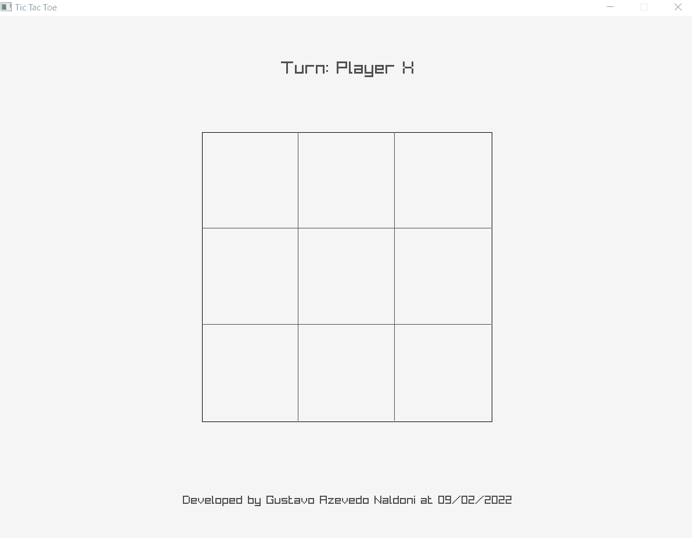
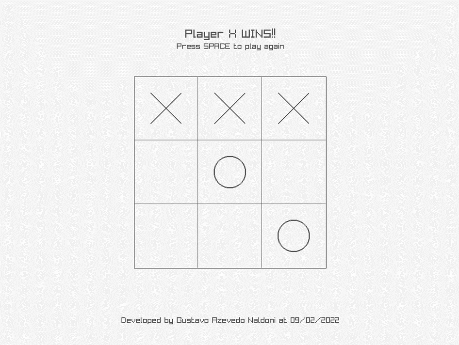
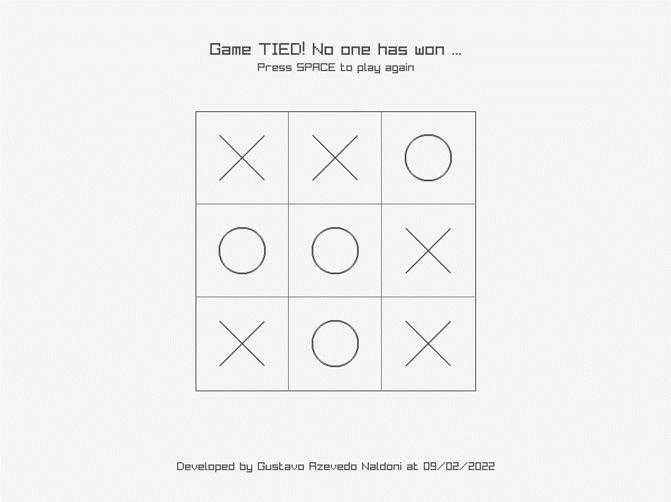

# TicTacToe Prototype in C!
This is an implementation of the classic TicTacToe game using only the good and old C programming languague. It was made to test the game logic of a college project and can be downloaded clicking [here](https://naldoni.itch.io/tictactoe-prototype-c).

## 🧱 Game structure
The game is set to be as minimalistic as possible, so it only has 1 menu and the controls are made using the left mouse key. 
To place a piece on the board just click on the quadrant you wanna play and a correct piece will be placed on it. After this the turn will pass and the seconde player cand do it as well.

## 🎲 Gameplay

## 👉 Screenshots
  

## 🤝 Contributing
Feel free to clone / create a fork of this repository and modify the game as you like to. Updates are welcome and you can use the code to any noncommercial purposes.

